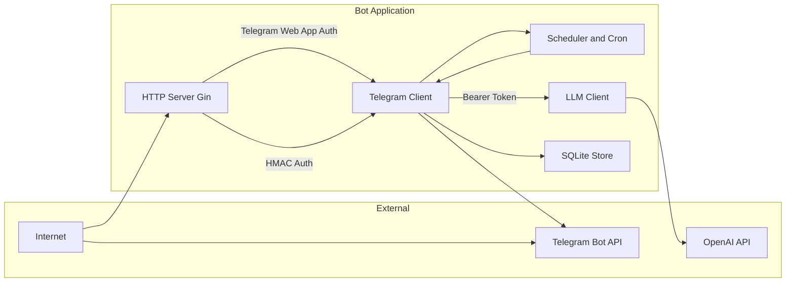

# dutyassistant Threat Model

## Executive Summary

The Duty Assistant Bot is a low-risk, small-scale household/Telegram group coordination system. The primary security concerns are around **credential protection** (Telegram bot token, OpenAI API key, DUTY_SECRET) and **authentication integrity** (Telegram Web App validation, group membership enforcement). The system demonstrates good security practices with parameterized SQL queries, HTML escaping, and proper authentication middleware. The highest-risk areas are credential exposure and potential authentication bypass in the Telegram-to-bot boundary.

## Scope and Assumptions

**In-scope:**
- Runtime application: `/Users/iv/Projects/dutyassistant/cmd/roster-bot/main.go` and `/internal/` packages
- HTTP API endpoints (`:8080` web server)
- Telegram Bot integration and handlers
- SQLite database interactions
- LLM integration (OpenAI client)
- Cron scheduler and background tasks

**Out-of-scope:**
- CI/CD tooling (`.github/workflows/`)
- Frontend JavaScript (`/web/js/`) - client-side security issues
- Test code (`*_test.go` files)
- Vendor dependencies
- Docker image base layers

**Explicit Assumptions:**
- 3-5 users, 1-2 admins, family/household use
- HTTP web interface is publicly accessible but requires Telegram Web App authentication
- User data is low sensitivity (nicknames, not real PII)
- Telegram Bot API is the only external dependency for messaging
- Admins are trusted family members
- Bot runs in Docker container with limited attack surface

**Open Questions:**
- Are there any external integrations beyond Telegram Bot API and OpenAI?
- Is the SQLite database file protected by filesystem permissions/encryption at rest?
- Are there monitoring/alerting capabilities for failed authentication attempts?

## System Model

### Primary Components

| Component | Description | Evidence |
|------------|-------------|------------|
| **Bot Application** | Main Go binary orchestrating Telegram bot, HTTP server, and scheduler | `cmd/roster-bot/main.go:25-378` |
| **HTTP Server (Gin)** | Web API serving schedule/chores to clients | `internal/http/server.go:15-92` |
| **Telegram Client** | Interface to Telegram Bot API for messaging and updates | `internal/telegram/bot.go:14-40` |
| **Scheduler** | Business logic for duty assignment and queue management | `internal/scheduler/scheduler.go:12-327` |
| **SQLite Store** | Database persistence layer for users, duties, chores, settings | `internal/store/sqlite/sqlite.go:14-814` |
| **LLM Client** | OpenAI integration for message refinement | `internal/llm/openai.go:16-264` |
| **Notification Service** | Formatted message generation and reminders | `internal/notification/` |

### Data Flows and Trust Boundaries

- **Internet → Telegram Bot API → Bot Application**
  - Data types: User commands, callback queries, message updates
  - Channel: HTTPS (Telegram Bot API)
  - Security guarantees: Telegram server authentication (bot token), group membership verification (`internal/telegram/bot.go:67-98`)

- **Internet → HTTP API → Bot Application**
  - Data types: Schedule requests, chore API calls, `/who` queries
  - Channel: HTTP (Gin framework on port 8080)
  - Security guarantees: Telegram Web App init data validation (`internal/http/middleware/auth.go:31-82`), HMAC auth for `/who` (`internal/http/middleware/hmac.go:26-67`)

- **Bot Application → SQLite Database**
  - Data types: User records, duty assignments, chores, settings
  - Channel: File-based SQLite (via `modernc.org/sqlite` driver)
  - Security guarantees: Parameterized queries (no SQL injection), database at `/app/data/roster.db` in container

- **Bot Application → OpenAI API**
  - Data types: Plain text messages for refinement
  - Channel: HTTPS (OpenAI API)
  - Security guarantees: Bearer token authentication, 10-second timeout (`cmd/roster-bot/main.go:40-51`)

- **Bot Application → Telegram Bot API (outgoing)**
  - Data types: Duty notifications, chore reminders, status messages
  - Channel: HTTPS (Telegram Bot API)
  - Security guarantees: HTML escaping for user content (`internal/llm/openai.go:85-126`), parse mode validation

- **Bot Application → Internal Scheduler (Cron)**
  - Data types: Time-triggered duty assignments, completions, reports
  - Channel: In-memory function calls
  - Security guarantees: No external exposure, Berlin timezone enforcement (`cmd/roster-bot/main.go:101-327`)

#### Diagram

## Assets and Security Objectives

| Asset | Why it matters | Security Objective |
|--------|----------------|-------------------|
| **Telegram Bot API Token** | Allows impersonation of the bot, sending arbitrary messages to group | Confidentiality, Integrity |
| **OpenAI API Key** | Enables unauthorized LLM usage, potential cost escalation | Confidentiality, Availability |
| **DUTY_SECRET** | Authenticates M2M `/who` endpoint, could expose duty assignments | Confidentiality, Integrity |
| **User Records** (names, Telegram IDs, admin status) | Enables targeted harassment if exposed | Confidentiality |
| **Duty/Chore Assignments** | Reveals household activity patterns if leaked | Confidentiality |
| **Notification Logs** | Contains failed notification details that could reveal system behavior | Confidentiality |
| **SQLite Database** | Contains all application state, backup target | Integrity, Availability |
| **Admin Privileges** | Allows modification of any duty assignment, user management | Integrity, Availability |

## Attacker Model

### Capabilities

- **External unauthenticated attacker**: Can initiate Telegram interactions (if they know the bot), can make HTTP requests to public endpoints
- **Compromised group member**: Has valid Telegram user credentials and group membership, can trigger bot commands
- **Secret exfiltration**: If any secret is leaked (bot token, API keys), attacker has full bot control or LLM access
- **Replay attacker**: Can capture and replay `/who` requests if timestamp validation fails
- **Admin imposter**: Can attempt to gain admin privileges through social engineering or token manipulation

### Non-capabilities

- **Code execution**: No evidence of remote code execution vulnerabilities
- **Database direct access**: SQLite is file-based within container, no network exposure
- **Telegram API compromise**: Assumes Telegram's infrastructure is secure
- **Man-in-the-middle on Telegram**: HTTPS protection assumed for Telegram Bot API
- **Multi-tenant isolation breach**: Single-tenant system, no cross-tenant data leakage

## Entry Points and Attack Surfaces

| Surface | How reached | Trust boundary | Notes | Evidence |
|---------|--------------|------------------|--------|------------|
| **Telegram Bot Updates** | Bot sends updates to registered webhook/long-polling | Telegram → Bot | Commands, callbacks, messages from group members | `internal/telegram/bot.go:102-116` |
| **HTTP API `/api/v1/*`** | Public web interface calls | HTTP → Bot | JSON requests, schedule queries, chore management | `internal/http/server.go:60-84` |
| **HTTP API `/who`** | Machine-to-machine endpoint for external integration | HTTP → Bot | HMAC-SHA256 authenticated queries | `internal/http/handlers/who.go:49-96` |
| **Cron Scheduler** | Internal time-based triggers | Internal | Daily assignments, completions, reports | `cmd/roster-bot/main.go:106-327` |
| **Interactive Sessions** | Multi-step command flows | Bot → Session Manager | 5-minute timeout, user-specific state | `internal/telegram/handlers/session.go:44-139` |
| **LLM Integration** | Message refinement calls | Bot → OpenAI API | Optional feature, uses OPENAI_API_KEY | `internal/llm/openai.go:195-264` |

## Top Abuse Paths

1. **Bot Token Compromise → Full Bot Control**
   - Attacker leaks `TELEGRAM_APITOKEN` from logs/env
   - Impersonates bot, sends arbitrary messages to group
   - Manipulates duty assignments, harvests user data

2. **Group Membership Bypass → Unauthorized Bot Access**
   - Attacker discovers DISH_GROUP ID or bypasses `checkAccess()` logic
   - Directly messages bot without being group member
   - Executes commands intended for family members

3. **Telegram Web App Auth Replay → Unauthorized HTTP Access**
   - Attacker captures valid `initData` from authenticated user
   - Reuses `tma <initData>` header to access `/api/v1/*` endpoints
   - Views schedules, modifies duties if victim has admin rights

4. **HMAC Secret Leakage → M2M Endpoint Compromise**
   - Attacker obtains `DUTY_SECRET` from deployment or logs
   - Generates valid signatures for `/who` endpoint
   - Exposes daily duty assignments and active chores

5. **OpenAI API Key Theft → Cost Escalation**
   - Attacker accesses `OPENAI_API_KEY` environment variable
   - Makes unauthorized LLM API calls
   - Accumulates usage charges on family account

6. **Admin Impersonation → Privilege Escalation**
   - Attaker discovers admin Telegram ID from logs or group
   - Uses bot admin commands (`/assign`, `/unassign`, `/toggleactive`)
   - Manipulates duty assignments to specific users

7. **Callback Manipulation → Chore/Tampering**
   - Attacker crafts callback data strings for inline keyboards
   - Triggers chore completion reminders or deletions
   - Manipulates chore system state through bot responses

8. **Database File Exposure → Full Data Access**
   - Attacker accesses SQLite file `/app/data/roster.db` on container host
   - Reads all user data, duty history, notification logs
   - Potentially modifies duty assignments directly

## Threat Model Table

| Threat ID | Threat source | Prerequisites | Threat action | Impact | Impacted assets | Existing controls (evidence) | Gaps | Recommended mitigations | Detection ideas | Likelihood | Impact severity | Priority |
|------------|----------------|---------------|----------------|--------|------------------|------------------------|------|----------------------|---------------|----------------|----------|
| TM-001 | Secret leakage (env vars, logs) | Bot token exposed in logs, Docker inspect, compromised CI/CD | Use leaked token to impersonate bot, send arbitrary messages to group | Telegram Bot API Token, all user data | Bot token passed via environment variable, not logged | Secrets in environment variables visible to container processes, potential logging | Use secret management (Docker secrets, Kubernetes secrets), enable audit logging for bot API calls | Monitor for unusual bot activity, failed authentication attempts | Low | High | Medium |
| TM-002 | Telegram Web App auth replay | Capture valid `initData` from network or browser storage | Reuse captured auth header to access HTTP endpoints | User-specific data, admin capabilities if victim is admin | Telegram Web App init data validated with cryptographic signature (`internal/http/middleware/auth.go:49`) | No expiration time validation in auth (timestamp passed as 0), potential replay window | Add expiration time validation to `initdata.Validate()`, implement nonce/token rotation | Log repeated auth attempts with same initData, monitor geographic IP patterns | Low | Medium | Medium |
| TM-003 | DUTY_SECRET compromise | Secret leaked from deployment, logs, or compromised webhook | Generate valid HMAC signatures for `/who` endpoint | DUTY_SECRET, duty assignments, active chores | HMAC-SHA256 with timestamp comparison (`internal/http/middleware/hmac.go:48-51`) | 5-minute timestamp window, secret stored in environment variable | Use proper secret management, rotate HMAC secret periodically, add rate limiting | Alert on repeated `/who` access failures, monitor signature validation logs | Low | Medium | Low |
| TM-004 | Group membership bypass | Discover DISH_GROUP ID, modify bot code or intercept calls | Bypass `checkAccess()` to use bot without group membership | All bot commands, admin functionality | Group membership checked via `GetChatMember()` API call (`internal/telegram/bot.go:82-98`) | Check happens after parsing, potential for information leakage before rejection | Harden access control, add rate limiting per user, implement allowlist | Monitor for access denied logs, alert on unusual command patterns | Low | High | Medium |
| TM-005 | OpenAI API key exposure | Key in environment variables, logged, or exposed in LLM error messages | Unauthorized LLM API usage, cost accumulation | OpenAI API Key, LLM budget | Key passed via environment variable, error handling strips sensitive info (`internal/llm/openai.go:240-244`) | Key visible to container processes, potential for logging of API requests | Use secret management, implement usage monitoring and alerting | Monitor LLM API usage patterns, set budget alerts | Low | Medium | Low |
| TM-006 | Callback data manipulation | Knowledge of callback action strings and message IDs | Craft callback queries to trigger unintended actions | Chore state, session data | Callback parsing with string splitting (`internal/telegram/bot.go:254-314`) | Limited validation of callback data format, no message ownership verification | Add callback data validation, verify message belongs to user before processing | Log invalid callback attempts, monitor for pattern anomalies | Medium | Medium | Medium |
| TM-007 | Database file exposure | Container misconfiguration, host filesystem access | Read/modify SQLite database file directly | All stored data, integrity of duty assignments | SQLite file at `/app/data/roster.db` in container (`cmd/roster-bot/main.go:29`) | No file-level encryption, visible to container processes | Encrypt database at rest, restrict file permissions, use volume mounts with restricted access | Monitor for direct file access attempts, integrity checks on startup | Low | High | Low |
| TM-008 | Admin ID discovery | Access to logs, group member list, or bot error messages | Determine admin Telegram ID for targeted attacks | Admin privileges, user management | Admin ID configurable via `ADMIN_ID` environment variable (`cmd/roster-bot/main.go:34-35`) | No protection against admin ID inference from bot behavior | Implement admin user confirmation dialogs, use multiple admin approval for critical actions | Log admin command usage, alert on unexpected admin operations | Medium | Medium | Medium |
| TM-009 | Cross-site scripting via LLM output | Malicious LLM response or prompt injection | Inject HTML/JavaScript into bot messages | User devices, session tokens | HTML escaping for Telegram messages (`internal/llm/openai.go:85-126`) | LLM responses sanitized, but potential for unescaped content in error paths | Harden LLM prompts, add content security policies, implement output validation | Monitor for suspicious message patterns, scan for HTML injection attempts | Low | Low | Low |
| TM-010 | Race condition in session management | Multiple rapid commands to same chat | Manipulate session state across multiple users | Session data, multi-step command state | Session manager with RWMutex and 5-minute cleanup (`internal/telegram/handlers/session.go:28-43`) | Sessions keyed by chat ID, potential for confusion between DM and group chats | Add user ID verification to session lookup, implement session ownership validation | Log session-related errors, monitor for rapid command sequences | Low | Medium | Low |

## Criticality Calibration

**Critical:** Vulnerabilities allowing complete system compromise, unauthorized bot control, or full data exfiltration
- Example: Bot token leakage enabling full impersonation, authentication bypass allowing admin commands

**High:** Vulnerabilities exposing sensitive data, enabling privilege escalation, or causing significant service disruption
- Example: Database file exposure, group membership bypass, admin ID compromise

**Medium:** Vulnerabilities requiring preconditions but with measurable impact on operations or data
- Example: Replay attacks against Telegram Web App auth, callback manipulation, HMAC secret exposure

**Low:** Vulnerabilities with limited impact, requiring unlikely preconditions or having minimal business impact
- Example: XSS via LLM output, session state confusion, minor information leakage

## Focus Paths for Security Review

| Path | Why it matters | Related Threat IDs |
|------|----------------|-------------------|
| `internal/telegram/bot.go:67-98` | Group membership access control - critical boundary for all bot operations | TM-002, TM-004 |
| `internal/http/middleware/auth.go:31-82` | Telegram Web App authentication logic - gateway for HTTP API | TM-002, TM-006 |
| `internal/http/middleware/hmac.go:26-67` | HMAC validation for M2M endpoint - protects `/who` endpoint | TM-003 |
| `internal/telegram/handlers/chore.go:70-150` | Command parsing and admin checks - entry point for chore management | TM-004, TM-008 |
| `internal/telegram/handlers/chore_callback.go:14-100` | Callback data handling - potential for manipulation attacks | TM-006 |
| `internal/telegram/handlers/session.go:44-139` | Session management - state tracking for multi-step commands | TM-010 |
| `internal/store/sqlite/sqlite.go:192-327` | User CRUD operations - database interaction layer | TM-007 |
| `cmd/roster-bot/main.go:28-52` | Environment variable handling and initialization - secret management | TM-001, TM-003, TM-005 |
| `internal/llm/openai.go:195-264` | LLM integration and output sanitization - external API calls | TM-009 |
| `internal/scheduler/scheduler.go:60-151` | Business logic for duty assignment - core application logic | TM-008 |

## Notes on Use

- **Database Security**: All SQL queries use parameterized statements with `?` placeholders, significantly reducing SQL injection risk (verified across all `internal/store/sqlite/` files)
- **Input Validation**: Date parsing uses strict format validation (`time.Parse("2006-01-02", input)`), and command arguments are sanitized before processing
- **HTML Escaping**: User-provided content is escaped before HTML rendering (`html.EscapeString()` calls throughout handlers)
- **Rate Limiting**: No application-level rate limiting detected - consider implementing for all public endpoints
- **Audit Logging**: Failed authentication attempts are logged, but no centralized alerting mechanism exists
- **Secret Management**: Secrets are environment variables - production deployment should use proper secret management
- **Testing**: Unit tests exist for authentication middleware and HMAC validation, indicating awareness of these security boundaries
